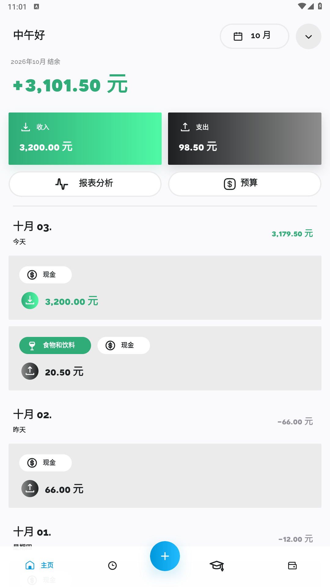
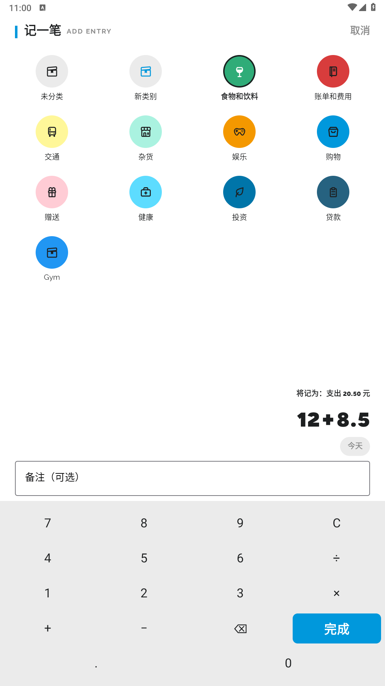
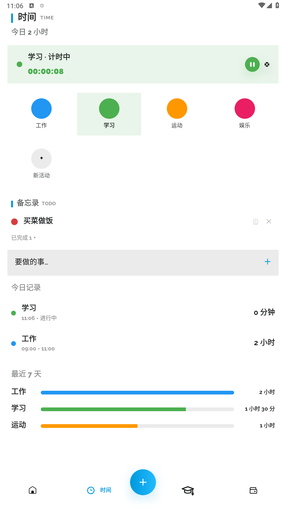
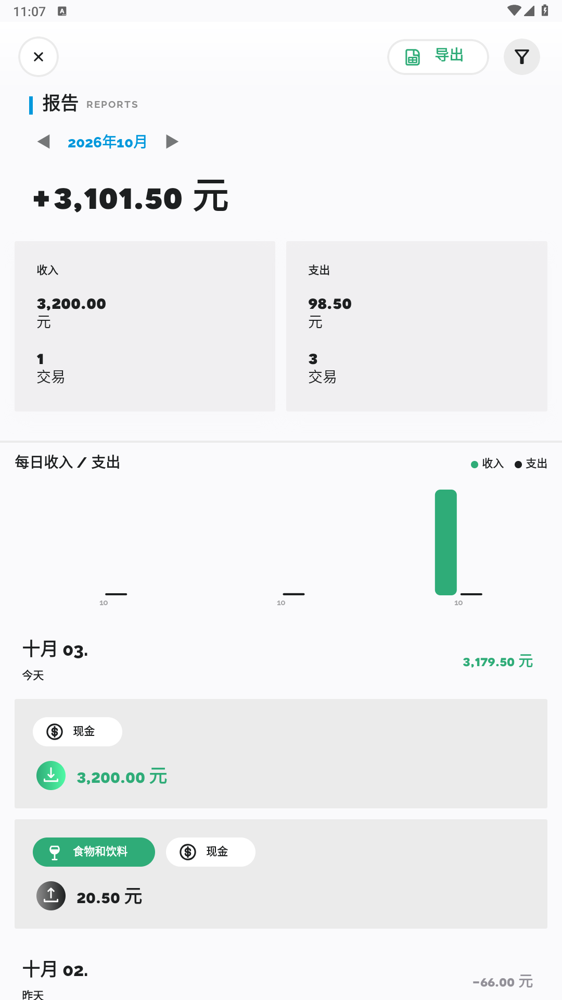
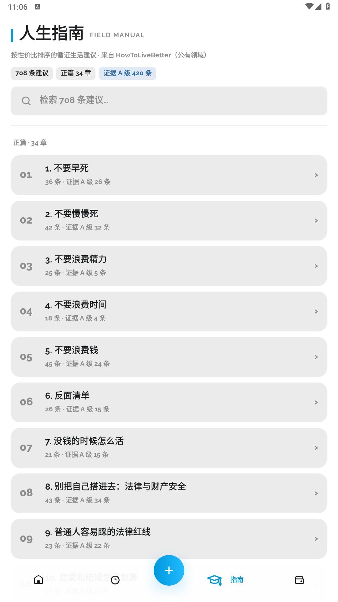

<div align="center">


# Simple Account（时账本）

**记账 × 时间管理 ｜ 本地优先 ｜ 无广告 ｜ 无账号 ｜ 开源免费**

给"想看清钱和时间都去哪了"的人：左边记钱，右边记时间，同一屏对照。

[](https://github.com/shushi2369/TimeLedger/releases)
[](LICENSE)

[](https://github.com/shushi2369/TimeLedger/stargazers)

**[⬇ 下载最新 APK](https://github.com/shushi2369/TimeLedger/releases/latest)**

</div>

---

## 📸 截图

| 主页 · 当月结余 | 快速记账 · 算式键盘 | 时间 · 计时 + 备忘录 |
|:---:|:---:|:---:|
|  |  |  |
| **报表 · 年月切换** | **人生指南** | |
|  |  | |

## ✨ 功能总览

### ⚡ 秒级记账
- **鲨鱼式快速记账**：底部「＋」直达 —— 类别网格 + 计算器键盘，支持 `12+8.5` 连算、`×÷` 优先级、两位小数自动四舍五入
- **一句话记账**：输入「昨天打车12元」自动识别金额/日期/分类（纯本地正则，不打字也能记）
- **正负即收支**：表达式 ≥0 记支出、<0 记收入（自动取绝对值），金额行实时预览「将记为：支出 20.50 元」
- 记错**一键撤销**（保存后 Snackbar）；`#标签` 多选；日期可选（补记/预记都行）；网格内**随手新建类别**
- **标签闭环**：管理页新建/重命名/删除标签，点标签反查全部相关交易，记账中可直达新建
- 转账、计划支付（周期记账到期一键入账）、账户与分类管理完整支持
- 桌面**余额小部件** + 快捷磁贴「记一笔支出」直达记账页

### ⏱️ 时间管理
- 点活动**开始计时**，点其他活动自动切换，支持**暂停/继续**；通知栏常驻秒表（系统级走秒，零轮询），计时中杀进程计时不断
- 活动可设**每日目标时长**，自动统计达成率
- 今日时间线支持**编辑起止时间与备注**（忘按开始/结束可补录），最近 7 天活动汇总比例条
- **备忘录 TODO**：时间页内随手记，点击红/绿点完成切换，支持**任意日期准点提醒**（AlarmManager，重启自动重排）

### 📊 报表与导入
- 主页**当月结余**大字（正绿负红），收支卡随月份切换；主页直达「占比」「预算」
- 每日收入/支出**柱状图**，微信账单式「◀ 2026年10月 ▶」**按月/按年切换**
- **分类占比环形扇形图**：每个分类一段弧（按分类配色），中心显示总额，明细列表带百分比，支出/收入一键切换，随期间联动
- **支付宝/微信账单 CSV 导入**：本地解析，自适应 UTF-8/GB18030/UTF-16 编码，按订单号去重，导入前可预览确认；支持欧式小数与 ISO 日期格式

### 🛡️ 隐私与数据
- **本地优先**：无账号体系、无广告、无数据收集，全功能离线可用
- **每日自动备份**（zip 保留最近 7 份）+ 一键恢复；CSV 导出（UTF-8 带 BOM，Excel 直接打开无乱码）
- **智能提醒全在本地**：计划支付到期提醒；授权通知使用权后可解析微信/支付宝/云闪付/银行短信的付款通知，弹提醒直达记账页——全程不联网、不上传

### 🎨 特色
- **明日方舟档案风 UI**：直角设计语言、中英双语标题（TIME / REPORTS / FIELD MANUAL）、Novecento Sans Wide 数字字型、深色模式
- **人生指南**：内置 [HowToLiveBetter](https://github.com/eternity4719/HowToLiveBetter) 708 条循证生活建议（公有领域），34 章按性价比着色，支持全文检索

## 🔍 质量保障

- **四轮双代理代码审计**：并行子代理从 UI 层、资金数据流、系统安全面、性能、状态保存等维度滚动深挖，累计发现 **90+ 项缺陷并修复 52 项**（含空集合 SQL 崩溃、暂停时长虚增、时区口径错误、组件暴露面等）
- **数据库迁移真机验证**：v0.19.0 的索引升级（130→131）在真机上完成旧库→新库迁移验证，用户数据零丢失
- 资金链路全程 BigDecimal、金额计算单测覆盖、深链与组件暴露面已收敛、无日志泄露敏感数据

## 📥 下载安装

前往 [**Releases**](https://github.com/shushi2369/TimeLedger/releases) 下载最新的 `Simple Account-*.apk` 安装即可。

- 系统要求：**Android 9.0+**
- 应用与数据完全在本地，卸载即删；换机前请先在 设置 → 导入导出 中备份

## 🔨 自己构建

```bash
git clone https://github.com/shushi2369/TimeLedger.git
cd TimeLedger
./gradlew :app:assembleDebug
# 产物：app/build/outputs/apk/debug/app-debug.apk
```

- 需要 **JDK 17**（Android Studio 自带）与 Android SDK 34；直接用 Android Studio 打开工程 Run 亦可
- 工程模块较多，首次全量构建偏慢，之后增量构建很快
- 建议：项目放在**纯 ASCII 路径**下构建；国内网络环境建议为 Gradle 配置 Maven 镜像或代理

技术栈：Kotlin 2.x ｜ Jetpack Compose ｜ Room ｜ Hilt ｜ WorkManager ｜ AlarmManager

架构说明：基于 [Ivy Wallet](https://github.com/Ivy-Apps/ivy-wallet) 的模块化 Compose 架构做增量开发，不改基座存量模块；时间管理为独立模块 `:feature:timetrack`，使用**独立 Room 小库**（`timetrack.db`），升级零迁移风险。

## 🙏 致谢与开源协议

本项目基于 **[Ivy Wallet](https://github.com/Ivy-Apps/ivy-wallet)**（GPL-3.0，2024-11 归档后由社区 fork 续命）二次开发，依 **GPL-3.0** 协议整体开源，在此感谢原作者与社区贡献者。

| 项目 | 协议 | 用途 |
|------|------|------|
| [Ivy Wallet](https://github.com/Ivy-Apps/ivy-wallet) | GPL-3.0 | 记账基座 |
| [Android-SimpleTimeTracker](https://github.com/Razeeman/Android-SimpleTimeTracker) | GPL-3.0 | 时间模块交互参考 |
| [HowToLiveBetter](https://github.com/eternity4719/HowToLiveBetter) | Unlicense | 人生指南内容 |
| [tickle-android](https://github.com/wangdachui886/tickle-android) | Apache-2.0 | 快速记账交互参考 |
| [PRTS Design](https://github.com/MooncellWiki/prts-design) | MIT | 明日方舟设计语言参考 |

本项目为独立作品，与上述项目官方无关。

## 📄 License

[GPL-3.0](LICENSE)。基于本项目的二次分发须同样以 GPL-3.0 开源，并保留原仓库版权声明。
